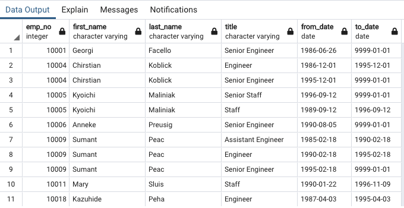
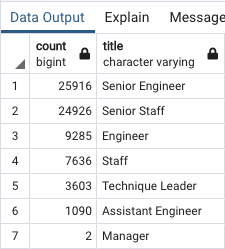
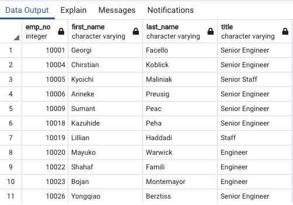
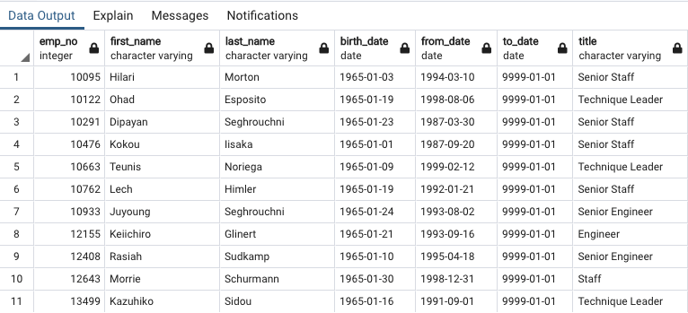
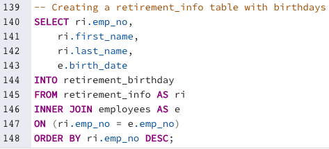
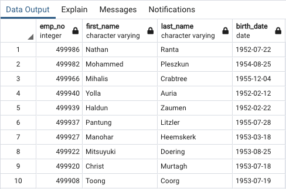
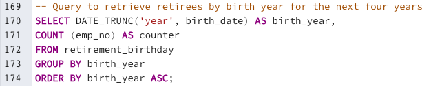
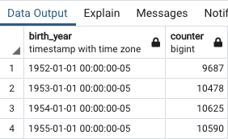
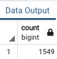

# Pewlett-Hackard-Analysis

## Overview

The purpose of this analysis is to help the HR department of Pewlett Hackard look into the future of employees retiring for the upcoming years. We are given six CSV files with different information and use PostgreSQL to create tables and merge columns to come up with the number of employees retiring. For this analysis we are using PostgreSQL version 14.1 and pgAdmin version 6.4.

## Results

- The table `retirement_titles` shows columns with the current employee's number, first name, last name, title, from date, and to date. This information is helpful to see the employees retiring at a glance, however the table is not filtered. The table has some employees show multiple entries due to promotions, as well as employees who no longer work here. 

- The `retiring_titles` table shows the sum of employees retiring based on their title. There are currently 72,458 employees retiring according to the `retiring_titles` table, with more than 70 percent of the employees being Senior Staff and Senior Engineers. However, this table does not filter out the multiple entries in the `titles.csv` due to some of the employees being promoted or no longer working at the company.

- The `unique_titles` table filters out the employees with multiple entries from the `retiring_titles` table. This table shows a list every employee retiring with their most recent title. This table should be used to make any future analysis.

The `mentorship_eligibility` table shows how many employees are currently available to mentor the new wave of Pewlett Hackard employees. This table currently has 1,549 employees, which is no where near the amount of employees retiring.

## Summary

### How many roles will need to be filled as the "silver tsunami" begins to make an impact?

We currently don't have any information or tables on how many employees are retiring on a yearly basis. We first create a new table called `retirement_birthday` using the `retirement_info` table and the `employees` table to add the birth_date column from `employees` into the `retirement_info` table.

 The query below creates a new table from the `retirement_birthyear` table that sums the number of employees that are retiring given their birth year. We use the `DATE_TRUNC('year', timestamp)` PostgreSQL Timestamp Function to round off a timestamp by the given parameters. We are using the year on the `birth_date` columm to sum the number of employees retiring given their birth year. We then group them by the employees' birth year and show the sum of those birth years.

There are currently 41,381 employees ready for retirement within the next four years. By creating the query below, we see can see how many employees are retiring by their birth year. Employees born in the year 1952 are retiring this year, employees born in 1953 are retiring next year, employees born in 1954 are retiring three years from now, and those born in 1955 are retiring four years from now. By looking at the table we created, we can see that 9,687 employees are retiring this year, 10,478 employees are retiring next year, 10,625 employees are retiring three years from now, and 10,590 employees are retiring four years from now.
We would need to hire at least the number of people we are losing in their respective year. 

### Are there enough qualified, retirement-ready employees in the departments to mentor the next generation of Pewlett Hackard employees?

By executing the query `SELECT COUNT(emp_no) FROM mentorship_eligibility;`, we can see that there are currently 1,549 employees eligible for the mentorship this year. That is 16% of the number of employees retiring this year. There are not enough employees to mentor the next generation of Pewlett Hackard employees. Each mentor would need to train at least 7 mentees to fill up the vacancies.

